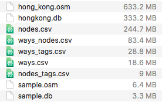

# Udacity DataNano P3 
# Wrangling OpenStreetMap Data with SQL

## Submission
1. **report.ipynb** : Jupyter Notebook containing data wrangling processes
2. **Python code**
      - **sample.py**: create a sample osm with k=100
      - **audit.py**        : audit cityname, phone, zipcode, streetname
      - **clean.py**        : update cityname, phone, streetname
      - **data.py**         : shape data to csv
      - **schema.py**       : define schema for database
      - **csv_to_db.py**    : import csv to database
3. **sample.osm** : sample osm with size less than 10MB
4. **other** : refer to the below

   

